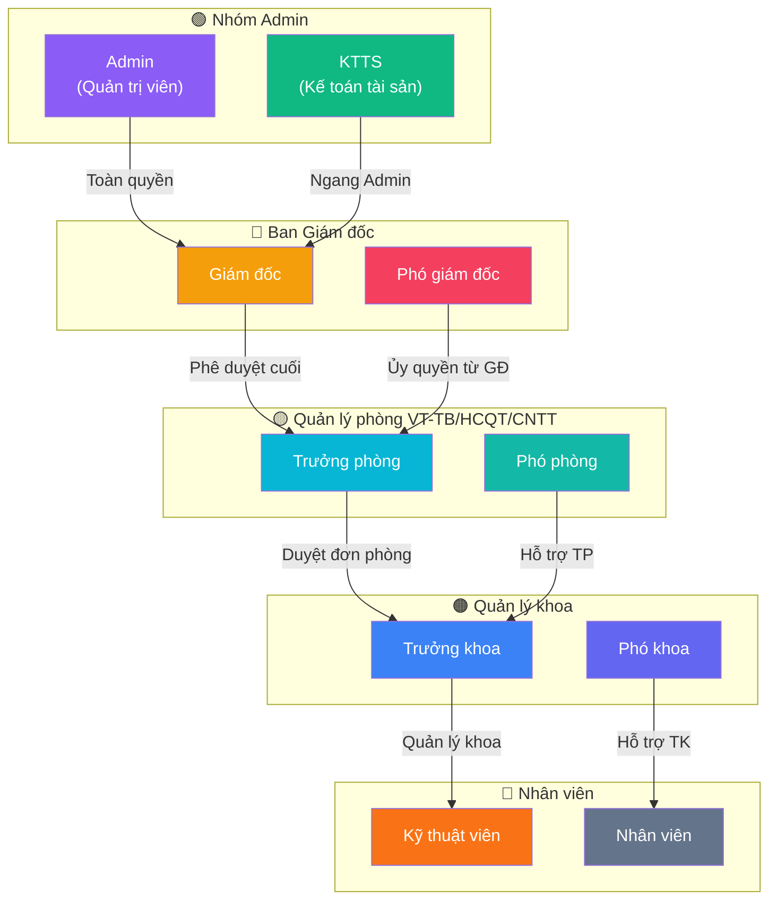

# 📊 Bảng quyền hạn chi tiết

> Bảng tổng hợp quyền truy cập của **10 vai trò** đối với tất cả chức năng trong hệ thống QLTS.

---

## Quy ước

| Ký hiệu | Ý nghĩa |
|---------|---------|
| ✅ | Có quyền đầy đủ |
| ✅ᴾ | Có quyền, giới hạn phạm vi phụ trách (VT-TB/HCQT/CNTT) |
| ✅ᴹ | Có quyền, giới hạn phòng/khoa mình |
| ✅ᴬᴰ | Tự động duyệt, không cần phê duyệt |
| ❌ | Không có quyền |

---

## Danh sách 10 vai trò

| # | Mã hệ thống | Tên hiển thị | Nhóm | Mô tả |
|---|-------------|-------------|------|-------|
| 1 | `ADMIN` | Quản trị viên | 🟢 Admin | Toàn quyền hệ thống, quản lý cấu hình, người dùng |
| 2 | `DIRECTOR` | Giám đốc | 🔴 Ban Giám đốc | Phê duyệt cấp cao nhất tất cả nghiệp vụ |
| 3 | `VICE_DIRECTOR` | Phó giám đốc | 🔴 Ban Giám đốc | Phê duyệt thay Giám đốc khi được ủy quyền |
| 4 | `DEPT_MANAGER` | Trưởng phòng | 🟡 Quản lý phòng | Duyệt đơn thuộc phạm vi phòng phụ trách (VT-TB/HCQT/CNTT) |
| 5 | `VICE_DEPT_MANAGER` | Phó phòng | 🟡 Quản lý phòng | Hỗ trợ Trưởng phòng, duyệt đơn trong phạm vi phụ trách |
| 6 | `SUPPLIES_MANAGER` | Trưởng khoa | 🟠 Quản lý khoa | Quản lý tài sản thuộc khoa, tạo đề xuất |
| 7 | `VICE_SUPPLIES_MANAGER` | Phó khoa | 🟠 Quản lý khoa | Hỗ trợ Trưởng khoa |
| 8 | `ASSET_ACCOUNTANT` | Kế toán tài sản | 🟢 KTTS | Toàn quyền nghiệp vụ tài sản, ngang Admin, không cần phê duyệt |
| 9 | `SUPPLIES_TECHNICIAN` | Kỹ thuật viên | 🔵 Nhân viên | Thực hiện sửa chữa, bảo dưỡng, kiểm kê |
| 10 | `STAFF` | Nhân viên | 🔵 Nhân viên | Xem tài sản phòng mình, báo hỏng, quét QR |

---

## Phân nhóm vai trò

---

## Phân quyền theo từng chức năng

### 1. Tổng quan & Báo cáo

| Chức năng | Admin | GĐ | PGĐ | TP | PP | TK | PK | KTTS | KTV | NV |
|-----------|:-----:|:--:|:---:|:--:|:--:|:--:|:--:|:----:|:---:|:--:|
| Dashboard | ✅ | ✅ | ✅ | ✅ | ✅ | ✅ | ✅ | ✅ | ❌ | ❌ |
| Xem chờ duyệt | ✅ | ✅ | ✅ | ✅ᴾ | ✅ᴾ | ❌ | ❌ | ✅ | ❌ | ❌ |
| Xem cảnh báo | ✅ | ✅ | ✅ | ✅ᴾ | ✅ᴾ | ❌ | ❌ | ✅ | ❌ | ❌ |
| Trung tâm báo cáo | ✅ | ✅ | ✅ | ❌ | ❌ | ❌ | ❌ | ✅ | ❌ | ❌ |
| Xuất Excel báo cáo | ✅ | ✅ | ✅ | ❌ | ❌ | ❌ | ❌ | ✅ | ❌ | ❌ |

---

### 2. Đề xuất mua thiết bị

| Chức năng | Admin | GĐ | PGĐ | TP | PP | TK | PK | KTTS | KTV | NV |
|-----------|:-----:|:--:|:---:|:--:|:--:|:--:|:--:|:----:|:---:|:--:|
| Xem danh sách | ✅ | ✅ | ✅ | ✅ᴾ | ✅ᴾ | ✅ᴹ | ✅ᴹ | ✅ | ✅ᴹ | ✅ᴹ |
| Tạo đề xuất | ✅ᴬᴰ | ✅ | ✅ | ✅ | ✅ | ✅ | ✅ | ✅ᴬᴰ | ✅ | ✅ |
| Phê duyệt | ✅ | ✅ | ✅ | ✅ᴾ | ✅ᴾ | ❌ | ❌ | ✅ | ❌ | ❌ |
| Xuất biên bản | ✅ | ✅ | ✅ | ✅ | ✅ | ❌ | ❌ | ✅ | ❌ | ❌ |

---

### 3. Quản lý Tài sản cố định / CCDC

| Chức năng | Admin | GĐ | PGĐ | TP | PP | TK | PK | KTTS | KTV | NV |
|-----------|:-----:|:--:|:---:|:--:|:--:|:--:|:--:|:----:|:---:|:--:|
| Xem danh sách | ✅ | ✅ | ✅ | ✅ᴾ | ✅ᴾ | ✅ᴹ | ✅ᴹ | ✅ | ✅ᴹ | ✅ᴹ |
| Xem chi tiết | ✅ | ✅ | ✅ | ✅ᴾ | ✅ᴾ | ✅ᴹ | ✅ᴹ | ✅ | ✅ᴹ | ✅ᴹ |
| Thêm mới tài sản | ✅ | ❌ | ❌ | ❌ | ❌ | ❌ | ❌ | ✅ | ❌ | ❌ |
| Chỉnh sửa | ✅ | ❌ | ❌ | ❌ | ❌ | ❌ | ❌ | ✅ | ❌ | ❌ |
| Xóa tài sản | ✅ | ❌ | ❌ | ❌ | ❌ | ❌ | ❌ | ✅ | ❌ | ❌ |
| Báo hỏng | ✅ | ✅ | ✅ | ✅ | ✅ | ✅ | ✅ | ✅ | ✅ | ✅ |
| In / Quét QR | ✅ | ✅ | ✅ | ✅ | ✅ | ✅ | ✅ | ✅ | ✅ | ✅ |
| Import Excel | ✅ | ❌ | ❌ | ❌ | ❌ | ❌ | ❌ | ✅ | ❌ | ❌ |
| Xem lịch sử | ✅ | ✅ | ✅ | ✅ | ✅ | ✅ | ✅ | ✅ | ✅ᴹ | ✅ᴹ |

---

### 4. Tăng giảm tài sản / CCDC

| Chức năng | Admin | GĐ | PGĐ | TP | PP | TK | PK | KTTS | KTV | NV |
|-----------|:-----:|:--:|:---:|:--:|:--:|:--:|:--:|:----:|:---:|:--:|
| Xem danh sách | ✅ | ✅ | ✅ | ✅ᴾ | ✅ᴾ | ✅ᴹ | ✅ᴹ | ✅ | ❌ | ❌ |
| Tạo phiếu tăng/giảm | ✅ | ❌ | ❌ | ❌ | ❌ | ❌ | ❌ | ✅ | ❌ | ❌ |
| Phê duyệt | ✅ | ✅ | ✅ | ❌ | ❌ | ❌ | ❌ | ✅ | ❌ | ❌ |

---

### 5. Điều chuyển tài sản / CCDC

| Chức năng | Admin | GĐ | PGĐ | TP | PP | TK | PK | KTTS | KTV | NV |
|-----------|:-----:|:--:|:---:|:--:|:--:|:--:|:--:|:----:|:---:|:--:|
| Xem danh sách | ✅ | ✅ | ✅ | ✅ᴾ | ✅ᴾ | ✅ᴹ | ✅ᴹ | ✅ | ✅ᴹ | ✅ᴹ |
| Tạo phiếu | ✅ᴬᴰ | ✅ | ✅ | ✅ | ✅ | ✅ | ✅ | ✅ᴬᴰ | ✅ | ✅ |
| Phê duyệt | ✅ | ✅ | ✅ | ✅ᴾ | ✅ᴾ | ❌ | ❌ | ✅ | ❌ | ❌ |
| Xuất biên bản | ✅ | ✅ | ✅ | ✅ | ✅ | ❌ | ❌ | ✅ | ❌ | ❌ |

---

### 6. Sửa chữa & Bảo dưỡng

| Chức năng | Admin | GĐ | PGĐ | TP | PP | TK | PK | KTTS | KTV | NV |
|-----------|:-----:|:--:|:---:|:--:|:--:|:--:|:--:|:----:|:---:|:--:|
| Xem danh sách | ✅ | ✅ | ✅ | ✅ᴾ | ✅ᴾ | ✅ᴹ | ✅ᴹ | ✅ | ✅ᴹ | ✅ᴹ |
| Tạo yêu cầu | ✅ᴬᴰ | ✅ | ✅ | ✅ | ✅ | ✅ | ✅ | ✅ᴬᴰ | ✅ | ✅ |
| Phê duyệt / Phân công | ✅ | ✅ | ✅ | ✅ᴾ | ✅ᴾ | ❌ | ❌ | ✅ | ❌ | ❌ |
| Thực hiện sửa chữa | ✅ | ❌ | ❌ | ✅ | ✅ | ❌ | ❌ | ✅ | ✅ | ❌ |
| Cập nhật kết quả | ✅ | ❌ | ❌ | ✅ | ✅ | ❌ | ❌ | ✅ | ✅ | ❌ |

---

### 7. Kiểm kê

| Chức năng | Admin | GĐ | PGĐ | TP | PP | TK | PK | KTTS | KTV | NV |
|-----------|:-----:|:--:|:---:|:--:|:--:|:--:|:--:|:----:|:---:|:--:|
| Tạo kỳ kiểm kê | ✅ | ❌ | ❌ | ❌ | ❌ | ❌ | ❌ | ✅ | ❌ | ❌ |
| Phê duyệt kỳ | ✅ | ✅ | ✅ | ❌ | ❌ | ❌ | ❌ | ✅ | ❌ | ❌ |
| Quét QR kiểm kê | ✅ | ❌ | ❌ | ✅ᴹ | ✅ᴹ | ✅ᴹ | ✅ᴹ | ✅ | ✅ᴹ | ✅ᴹ |
| Kết thúc kiểm kê | ❌ | ❌ | ❌ | ✅ᴹ | ✅ᴹ | ✅ᴹ | ✅ᴹ | ✅ | ❌ | ❌ |
| Đối chiếu & xử lý | ✅ | ❌ | ❌ | ❌ | ❌ | ❌ | ❌ | ✅ | ❌ | ❌ |

---

### 8. Kiểm định thiết bị

| Chức năng | Admin | GĐ | PGĐ | TP | PP | TK | PK | KTTS | KTV | NV |
|-----------|:-----:|:--:|:---:|:--:|:--:|:--:|:--:|:----:|:---:|:--:|
| Xem danh sách | ✅ | ✅ | ✅ | ✅ᴾ | ✅ᴾ | ✅ᴹ | ✅ᴹ | ✅ | ❌ | ❌ |
| Tạo yêu cầu kiểm định | ✅ | ❌ | ❌ | ✅ᴾ | ❌ | ❌ | ❌ | ✅ | ❌ | ❌ |
| Cập nhật kết quả | ✅ | ❌ | ❌ | ✅ᴾ | ✅ᴾ | ❌ | ❌ | ✅ | ✅ | ❌ |

---

### 9. Tính hao mòn

| Chức năng | Admin | GĐ | PGĐ | TP | PP | TK | PK | KTTS | KTV | NV |
|-----------|:-----:|:--:|:---:|:--:|:--:|:--:|:--:|:----:|:---:|:--:|
| Xem dữ liệu hao mòn | ✅ | ✅ | ✅ | ✅ᴾ | ✅ᴾ | ❌ | ❌ | ✅ | ❌ | ❌ |
| Tạo phiếu tính hao mòn | ✅ | ❌ | ❌ | ❌ | ❌ | ❌ | ❌ | ✅ | ❌ | ❌ |
| Xóa phiếu (tính lại) | ✅ | ❌ | ❌ | ❌ | ❌ | ❌ | ❌ | ✅ | ❌ | ❌ |
| Tính hao mòn hàng loạt | ✅ | ❌ | ❌ | ❌ | ❌ | ❌ | ❌ | ✅ | ❌ | ❌ |
| Xuất Excel | ✅ | ✅ | ✅ | ❌ | ❌ | ❌ | ❌ | ✅ | ❌ | ❌ |

---

### 10. Đánh giá lại nguyên giá

| Chức năng | Admin | GĐ | PGĐ | TP | PP | TK | PK | KTTS | KTV | NV |
|-----------|:-----:|:--:|:---:|:--:|:--:|:--:|:--:|:----:|:---:|:--:|
| Xem danh sách | ✅ | ✅ | ✅ | ✅ᴾ | ✅ᴾ | ❌ | ❌ | ✅ | ❌ | ❌ |
| Tạo phiếu đánh giá lại | ✅ | ❌ | ❌ | ❌ | ❌ | ❌ | ❌ | ✅ | ❌ | ❌ |
| Xem lịch sử | ✅ | ✅ | ✅ | ✅ | ✅ | ❌ | ❌ | ✅ | ❌ | ❌ |
| Xuất biên bản | ✅ | ✅ | ✅ | ❌ | ❌ | ❌ | ❌ | ✅ | ❌ | ❌ |

---

### 11. Hệ thống

| Chức năng | Admin | GĐ | PGĐ | TP | PP | TK | PK | KTTS | KTV | NV |
|-----------|:-----:|:--:|:---:|:--:|:--:|:--:|:--:|:----:|:---:|:--:|
| Quản lý nhà cung cấp | ✅ | ✅ | ✅ | ❌ | ❌ | ❌ | ❌ | ✅ | ❌ | ❌ |
| Quản lý loại tài sản | ✅ | ✅ | ✅ | ❌ | ❌ | ❌ | ❌ | ✅ | ❌ | ❌ |
| Quản lý danh mục | ✅ | ✅ | ✅ | ❌ | ❌ | ❌ | ❌ | ✅ | ❌ | ❌ |
| Quản lý phòng ban | ✅ | ✅ | ✅ | ❌ | ❌ | ❌ | ❌ | ✅ | ❌ | ❌ |
| Quản lý tài khoản | ✅ | ❌ | ❌ | ❌ | ❌ | ❌ | ❌ | ❌ | ❌ | ❌ |
| Phân quyền | ✅ | ❌ | ❌ | ❌ | ❌ | ❌ | ❌ | ❌ | ❌ | ❌ |
| Thông báo | ✅ | ✅ | ✅ | ✅ | ✅ | ✅ | ✅ | ✅ | ✅ | ✅ |
| Cấu hình hệ thống | ✅ | ❌ | ❌ | ❌ | ❌ | ❌ | ❌ | ❌ | ❌ | ❌ |

---

## Ghi chú quan trọng

> **Admin & KTTS** có quyền tương đương — khi tạo đơn (điều chuyển, sửa chữa, đề xuất mua) thì **tự động duyệt**, không cần qua cấp phê duyệt.

> **Trưởng phòng (TP) & Phó phòng (PP)** chỉ duyệt đơn nếu tài sản thuộc **phạm vi phụ trách** của phòng VT-TB / HCQT / CNTT. Các phòng khác không có quyền duyệt.

> **Trưởng khoa (TK) & Phó khoa (PK)** chỉ xem và tạo đơn cho **khoa/phòng mình**. Không có quyền phê duyệt.

> **Kỹ thuật viên (KTV)** có quyền đặc biệt: thực hiện sửa chữa, bảo dưỡng và kiểm kê (quét QR).

> **Nhân viên (NV)** chỉ xem tài sản phòng mình, báo hỏng và quét QR khi kiểm kê.

---

## Viết tắt

| Viết tắt | Đầy đủ |
|----------|--------|
| **GĐ** | Giám đốc |
| **PGĐ** | Phó giám đốc |
| **TP** | Trưởng phòng |
| **PP** | Phó phòng |
| **TK** | Trưởng khoa |
| **PK** | Phó khoa |
| **KTTS** | Kế toán tài sản |
| **KTV** | Kỹ thuật viên |
| **NV** | Nhân viên |
