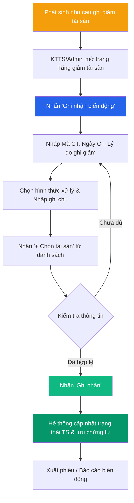

# 📈 Tăng giảm Tài sản

> **Đường dẫn:** Menu bên trái → Tài sản cố định → Tăng giảm
>
> **Quyền truy cập:** Yêu cầu quyền `asset-change:readAll`

---

## Màn hình chính

Trang quản lý các biến động tăng và giảm tài sản cố định trong kỳ. Chức năng giúp Kế toán tài sản (KTTS) và Quản trị viên theo dõi lịch sử biến động tài sản, phục vụ công tác hạch toán và báo cáo tài chính.

### Thẻ thống kê tổng quan

| Thẻ | Mô tả |
|-----|-------|
| **Tổng số biến động** | Tổng số phiếu ghi nhận tăng/giảm trong kỳ |
| **Tổng biến động TĂNG** | Tổng số phiếu ghi tăng tài sản (mua mới, tiếp nhận, nâng cấp) |
| **Tổng biến động GIẢM** | Tổng số phiếu ghi giảm tài sản (thanh lý, mất mát, tiêu hủy) |

### Bảng danh sách

| Cột | Mô tả |
|-----|-------|
| **Mã chứng từ** | Mã phiếu ghi nhận (VD: `TG-2608-3470`) |
| **Ngày chứng từ** | Ngày phát sinh phiếu ghi nhận |
| **Loại biến động** | Nhãn **Tăng** (màu xanh green/blue) hoặc **Giảm** (màu cam/đỏ) |
| **Lý do biến động** | Lý do cụ thể (Loại bỏ, Thanh lý, Mua mới, Điều chuyển...) |
| **Số lượng tài sản** | Số lượng tài sản bị ảnh hưởng |
| **Tổng giá trị** | Tổng nguyên giá / giá trị biến động (VNĐ) |
| **Thao tác** | Nút `⋮` cho phép **Xem chi tiết** phiếu ghi nhận |

---

## Quy trình Ghi nhận biến động GIẢM tài sản (KTTS/Admin)

Chức năng **Ghi giảm tài sản** được sử dụng khi tài sản bị thanh lý, loại bỏ, mất mát, tiêu hủy hoặc điều chuyển khỏi đơn vị.

### Bước 1 — Mở form ghi nhận biến động

1. Truy cập **Tài sản cố định → Tăng giảm**.
2. Nhấn nút **"Ghi nhận biến động"** ở góc trên bên phải màn hình.

### Bước 2 — Nhập thông tin phiếu ghi giảm

Điền các thông tin trên form:

| Trường | Bắt buộc | Mô tả |
|--------|:--------:|-------|
| **Mã chứng từ** | ✅ | Hệ thống tự động sinh mã (VD: `TG-2608-xxxx`), có thể tùy chỉnh |
| **Ngày chứng từ** | ✅ | Ngày thực hiện ghi giảm (mặc định là ngày hiện tại) |
| **Lý do ghi giảm** | ✅ | Chọn lý do từ danh sách dropdown: *Loại bỏ, Thanh lý, Thu hồi, Mất mát, Biếu tặng, Tiêu hủy, Bán/Chuyển nhượng...* |
| **Hình thức xử lý** | ❌ | Chọn hình thức xử lý tài sản (Bán thanh lý, Tiêu hủy, Nộp NSNN...) tùy theo lý do đã chọn |
| **Ghi chú / Lý do chi tiết** | ❌ | Nhập diễn giải chi tiết nguyên nhân ghi giảm hoặc số hiệu văn bản/quyết định phê duyệt |

### Bước 3 — Chọn tài sản ghi giảm

1. Nhấn nút **"+ Chọn tài sản"**.
2. Popup danh sách tài sản hiển thị, tích chọn một hoặc nhiều tài sản cần ghi giảm.
3. Nhấn **"Xác nhận"** để đưa tài sản vào danh sách biến động.

### Bước 4 — Hoàn tất ghi nhận

1. Kiểm tra lại danh sách tài sản và tổng số lượng.
2. Nhấn nút **"Ghi nhận"** để lưu chứng từ.
3. Hệ thống chuyển trạng thái tài sản thành **Đã thanh lý / Giảm** và lưu lại lịch sử biến động.

---

## Quy trình Ghi nhận biến động TĂNG tài sản

Biến động tăng tài sản cố định được ghi nhận tự động hoặc thủ công trong các trường hợp:

- **Mua sắm mới:** Sau khi quy trình Đề xuất mua thiết bị được duyệt và hoàn thành bàn giao.
- **Tiếp nhận / Điều chuyển đến:** Sau khi hoàn thành Biên bản tiếp nhận/điều chuyển từ đơn vị khác.
- **Đánh giá tăng nguyên giá:** Khi nâng cấp, cải tạo làm tăng nguyên giá tài sản.

---

## Luồng xử lý quy trình Ghi giảm tài sản

---

## Các lý do ghi giảm thường gặp

| Lý do ghi giảm | Mô tả |
|----------------|-------|
| **Thanh lý** | Tài sản hết hạn sử dụng, hư hỏng không thể sửa chữa |
| **Loại bỏ / Tiêu hủy** | Tài sản mất tác dụng, nguy hiểm hoặc hủy bỏ theo quy định |
| **Mất mát / Thất thoát** | Tài sản bị mất sau kỳ kiểm kê |
| **Bán / Chuyển nhượng** | Nhượng lại tài sản cho đơn vị khác theo quyết định |
| **Thu hồi** | Cấp trên hoặc cơ quan có thẩm quyền thu hồi tài sản |

---

## Ai được làm gì?

| Thao tác | 🟢 Kế toán TS | 🔴 Giám đốc | 🟡 Trưởng phòng | 🔵 Nhân viên |
|----------|:--------------:|:-----------:|:---------------:|:------------:|
| Xem danh sách biến động | ✅ Toàn bộ | ✅ Toàn bộ | ✅ Phòng phụ trách | ✅ Phòng mình |
| Xem chi tiết chứng từ | ✅ | ✅ | ✅ | ✅ |
| Ghi nhận biến động (Tăng/Giảm) | ✅ | ❌ | ❌ | ❌ |
| Xuất danh sách Excel | ✅ | ✅ | ✅ | ❌ |

> **Lưu ý:** Kế toán tài sản (KTTS) và Admin là hai vai trò duy nhất có quyền thực hiện **Ghi nhận biến động tăng/giảm** tài sản trên hệ thống.
