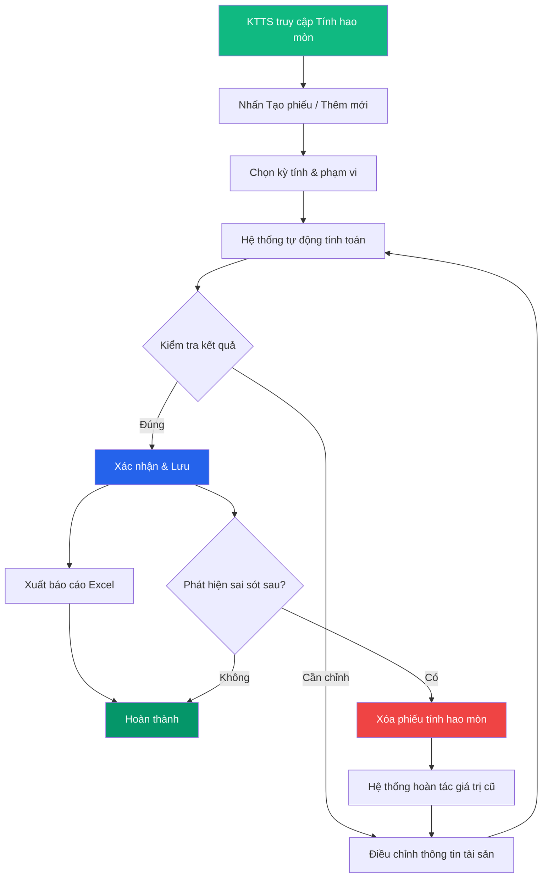

# 💰 Tính hao mòn (Khấu hao)

> **Đường dẫn:** Menu bên trái → Tài sản cố định → Tính hao mòn
>
> **Quyền truy cập:** Yêu cầu quyền `asset-depreciation:readAll`

---

## Màn hình chính

Quản lý và tính toán khấu hao / hao mòn tài sản cố định theo phương pháp đường thẳng. Đây là chức năng **chỉ dành cho Kế toán tài sản (KTTS)**.

### Bảng danh sách

| Cột | Mô tả |
|-----|-------|
| **Mã tài sản** | Mã định danh |
| **Tên tài sản** | Tên tài sản |
| **Nguyên giá** | Giá trị ban đầu (VNĐ) |
| **Số năm sử dụng** | Thời gian sử dụng dự kiến |
| **Hao mòn năm** | Mức hao mòn tính cho năm hiện tại |
| **Hao mòn lũy kế** | Tổng hao mòn từ đầu đến nay |
| **Giá trị còn lại** | Nguyên giá − Hao mòn lũy kế |
| **Tỷ lệ hao mòn** | Phần trăm đã hao mòn |

---

## Quy trình tính hao mòn (KTTS thực hiện)

### Bước 1 — Khởi tạo phiếu tính hao mòn

KTTS truy cập **Tài sản cố định → Tính hao mòn**, nhấn **"Tạo phiếu tính hao mòn"** hoặc **"Thêm mới"**.

Hệ thống hiển thị form với các thông tin:

| Trường | Mô tả |
|--------|-------|
| **Kỳ tính** | Chọn năm/kỳ tính hao mòn |
| **Phạm vi** | Tất cả tài sản hoặc theo phòng ban |
| **Phương pháp** | Đường thẳng (mặc định) |

### Bước 2 — Hệ thống tự động tính toán

Hệ thống tính hao mòn theo công thức:

> **Hao mòn năm = Nguyên giá ÷ Số năm sử dụng**
>
> **Hao mòn lũy kế = Σ Hao mòn các năm trước + Hao mòn năm nay**
>
> **Giá trị còn lại = Nguyên giá − Hao mòn lũy kế**

### Bước 3 — Kiểm tra và xác nhận

- KTTS xem lại kết quả tính toán trên bảng dữ liệu.
- Kiểm tra các tài sản đã hết thời gian sử dụng (Giá trị còn lại = 0).
- Xác nhận để lưu kết quả vào hệ thống.

### Bước 4 — Xuất báo cáo

KTTS có thể xuất bảng hao mòn dưới dạng **Excel** để phục vụ hạch toán kế toán và báo cáo tài chính.

---

## Xóa tính hao mòn để tính lại

Khi phát hiện kết quả tính hao mòn **không chính xác** (do thông tin tài sản sai, nguyên giá thay đổi, hoặc sai kỳ tính), KTTS có thể **xóa phiếu tính hao mòn đã lưu** và tính lại.

### Quy trình xóa & tính lại

| Bước | Thao tác | Mô tả |
|------|----------|-------|
| 1 | **Chọn phiếu cần xóa** | Trong danh sách phiếu tính hao mòn, click vào nút thao tác (⋮) trên phiếu cần xóa |
| 2 | **Nhấn "Xóa"** | Hệ thống hiển thị popup xác nhận: *"Bạn có chắc chắn muốn xóa phiếu tính hao mòn này?"* |
| 3 | **Xác nhận xóa** | Nhấn **"Đồng ý"** — hệ thống sẽ hoàn tác kết quả hao mòn (trả lại giá trị cũ cho tài sản) |
| 4 | **Chỉnh sửa thông tin** | Cập nhật lại thông tin tài sản nếu cần (nguyên giá, số năm sử dụng...) |
| 5 | **Tính lại** | Tạo phiếu tính hao mòn mới theo quy trình ở trên |

:::warning Lưu ý
Khi xóa phiếu tính hao mòn, hệ thống sẽ **tự động hoàn tác** các giá trị Hao mòn lũy kế và Giá trị còn lại về trạng thái trước khi tính. Chỉ KTTS mới có quyền xóa.
:::

---

## Lưu ý nghiệp vụ

- **Thời điểm tính:** Hao mòn thường được tính cuối năm hoặc theo kỳ quy định của đơn vị.
- **Tài sản mới:** Tài sản nhận trong năm được tính hao mòn từ tháng bắt đầu sử dụng.
- **Tài sản hết hao mòn:** Tài sản có Giá trị còn lại = 0 vẫn được quản lý trên hệ thống cho đến khi thanh lý.
- **Xóa để tính lại:** KTTS có thể xóa phiếu đã lưu để tính lại nếu phát hiện sai sót.
- **KTTS là người duy nhất** có quyền tạo/xóa phiếu tính hao mòn — không cần phê duyệt từ cấp trên.

---

## Luồng xử lý

---

## Ai được làm gì?

| Thao tác | 🟢 Kế toán TS | 🔴 Giám đốc | 🟡 Trưởng phòng | 🔵 Nhân viên |
|----------|--------------|-------------|----------------|-------------|
| Xem dữ liệu hao mòn | ✅ | ✅ | ✅ (phòng phụ trách) | ❌ |
| Tạo phiếu tính hao mòn | ✅ | ❌ | ❌ | ❌ |
| Xóa phiếu (để tính lại) | ✅ | ❌ | ❌ | ❌ |
| Tính hao mòn hàng loạt | ✅ | ❌ | ❌ | ❌ |
| Xuất Excel | ✅ | ✅ | ❌ | ❌ |

> **Lưu ý:** Kế toán tài sản (KTTS) tạo phiếu tính hao mòn **không cần qua cấp phê duyệt** — tương đương quyền Admin.
