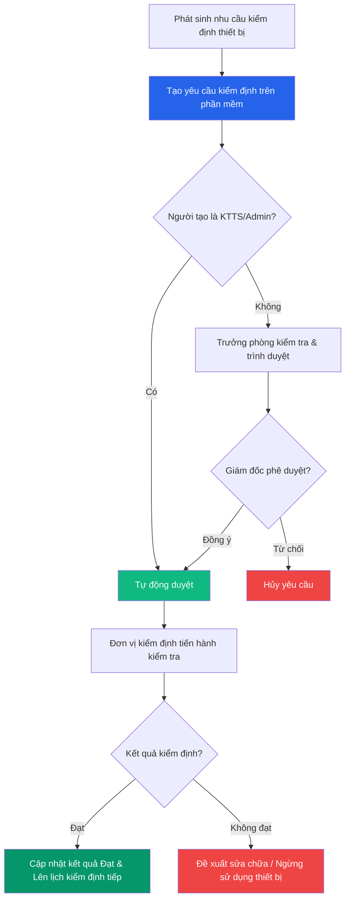

# 🔍 Kiểm định Thiết bị

> **Đường dẫn:** Menu bên trái → Tài sản cố định → Kiểm định thiết bị
>
> **Quyền truy cập:** Tất cả vai trò (theo phạm vi phòng ban)

---

## Màn hình chính

Trang này quản lý toàn bộ lịch sử và kế hoạch kiểm định thiết bị y tế, thiết bị kỹ thuật theo quy định pháp luật và nội bộ đơn vị. Đảm bảo mọi thiết bị đang sử dụng đều được kiểm tra an toàn, đạt chuẩn vận hành.

---

## Thanh công cụ & Bộ lọc

| Thành phần | Mô tả |
|------------|-------|
| **➕ Tạo yêu cầu kiểm định** | Mở form tạo phiếu kiểm định mới |
| **🔍 Tìm kiếm** | Tìm theo mã yêu cầu, tên thiết bị |
| **Trạng thái** | Lọc: *Chờ duyệt / Đang thực hiện / Hoàn thành / Không đạt* |
| **Từ ngày / Đến ngày** | Lọc theo khoảng thời gian kiểm định |

---

## Bảng dữ liệu

| Cột | Mô tả |
|-----|-------|
| **Mã yêu cầu** | Mã phiếu kiểm định (VD: `KĐ-2608-xxxx`) |
| **Tên thiết bị** | Tên tài sản/thiết bị cần kiểm định |
| **Mã thiết bị** | Mã TSCĐ tương ứng |
| **Ngày kiểm định lần cuối** | Lần kiểm định gần nhất đã thực hiện |
| **Ngày kiểm định tiếp theo** | Ngày dự kiến kiểm định tiếp theo |
| **Trạng thái** | *Đạt / Không đạt / Chưa kiểm định / Đang chờ kết quả* |
| **Đơn vị kiểm định** | Tổ chức/cơ quan thực hiện kiểm định (nội bộ hoặc bên ngoài) |
| **Thao tác** | Nút `⋮` mở menu (*Xem chi tiết*, *Phê duyệt*, *Cập nhật kết quả*) |

---

## Quy trình Kiểm định Thiết bị

### Bước 1 — Tạo yêu cầu kiểm định

1. Truy cập **Tài sản cố định → Kiểm định thiết bị**.
2. Nhấn nút **"Tạo yêu cầu kiểm định"**.
3. Điền thông tin trong form:

| Trường | Bắt buộc | Mô tả |
|--------|:--------:|-------|
| **Thiết bị cần kiểm định** | ✅ | Chọn thiết bị/tài sản từ danh sách |
| **Loại kiểm định** | ✅ | *Kiểm định ban đầu / Kiểm định định kỳ / Kiểm định bất thường* |
| **Đơn vị kiểm định** | ✅ | Chọn tổ chức thực hiện kiểm định |
| **Ngày dự kiến kiểm định** | ✅ | Ngày dự kiến tiến hành kiểm định |
| **Ghi chú** | ❌ | Ghi chú bổ sung |

4. Nhấn **"Thêm mới"** để gửi yêu cầu.

### Bước 2 — Phê duyệt yêu cầu kiểm định

- 🟢 **Kế toán tài sản (KTTS) / Admin:** Tự động duyệt khi tạo yêu cầu.
- 🟡 **Trưởng phòng phụ trách:** Kiểm tra và duyệt yêu cầu thuộc phạm vi phòng mình.
- 🔴 **Giám đốc:** Phê duyệt cuối cùng.

### Bước 3 — Thực hiện kiểm định

Đơn vị kiểm định tiến hành kiểm tra, đo lường theo quy chuẩn kỹ thuật. Kết quả được ghi nhận trong biên bản kiểm định.

### Bước 4 — Cập nhật kết quả kiểm định

1. Sau khi có kết quả, nhấn `⋮` → **"Cập nhật kết quả"**.
2. Chọn kết quả: **Đạt** hoặc **Không đạt**.
3. Nhập ngày kiểm định tiếp theo (nếu Đạt) hoặc đề xuất xử lý (nếu Không đạt).

---

## Luồng xử lý kiểm định thiết bị

---

## Ai được làm gì?

| Thao tác | 🟢 Kế toán TS | 🔴 Giám đốc | 🟡 Trưởng phòng | 🔵 Nhân viên |
|----------|:--------------:|:-----------:|:---------------:|:------------:|
| Xem danh sách kiểm định | ✅ Toàn bộ | ✅ Toàn bộ | ✅ (phòng phụ trách) | ✅ (phòng mình) |
| Tạo yêu cầu kiểm định | ✅ (tự duyệt) | ✅ | ✅ | ❌ |
| Phê duyệt | ✅ | ✅ | ✅ (phòng phụ trách) | ❌ |
| Cập nhật kết quả | ✅ | ❌ | ✅ | ❌ |
