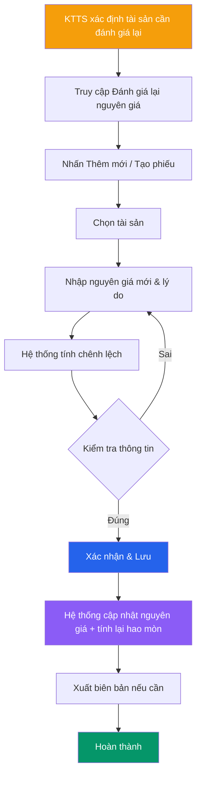

# 🔄 Đánh giá lại nguyên giá

> **Đường dẫn:** Menu bên trái → Tài sản cố định → Đánh giá lại nguyên giá
>
> **Quyền truy cập:** Yêu cầu quyền `asset-reassessment:readAll`

---

## Màn hình chính

Giúp bạn quản lý việc đánh giá lại nguyên giá tài sản khi có thay đổi giá trị theo quy định. Đây là chức năng **chỉ dành cho Kế toán tài sản (KTTS)**.

### Bảng danh sách

| Cột | Mô tả |
|-----|-------|
| **Mã phiếu** | Mã phiếu đánh giá lại |
| **Mã tài sản** | Mã định danh tài sản |
| **Tên tài sản** | Tên tài sản |
| **Nguyên giá cũ** | Giá trị trước khi đánh giá lại (VNĐ) |
| **Nguyên giá mới** | Giá trị sau khi đánh giá lại (VNĐ) |
| **Chênh lệch** | Mức chênh lệch (+ tăng / − giảm) |
| **Ngày đánh giá** | Ngày thực hiện đánh giá lại |
| **Lý do** | Lý do đánh giá lại |
| **Trạng thái** | Trạng thái phiếu |

---

## Quy trình đánh giá lại nguyên giá (KTTS thực hiện)

### Bước 1 — Xác định nhu cầu đánh giá lại

KTTS xác định tài sản cần đánh giá lại nguyên giá trong các trường hợp:

| Trường hợp | Mô tả |
|------------|-------|
| **Nâng cấp, cải tạo** | Tài sản được nâng cấp làm tăng giá trị |
| **Kiểm kê phát hiện chênh lệch** | Giá trị thực tế khác giá trị sổ sách |
| **Theo quy định Nhà nước** | Điều chỉnh theo thông tư, nghị định mới |
| **Sát nhập, chia tách** | Tài sản được sát nhập hoặc chia tách |
| **Thẩm định lại** | Cơ quan có thẩm quyền thẩm định lại giá trị |

### Bước 2 — Tạo phiếu đánh giá lại

KTTS truy cập **Tài sản cố định → Đánh giá lại nguyên giá**, nhấn **"Thêm mới"** hoặc **"Tạo phiếu"**.

Hệ thống hiển thị form:

| Trường | Mô tả | Bắt buộc |
|--------|-------|----------|
| **Chọn tài sản** | Tìm kiếm và chọn tài sản cần đánh giá lại | ✅ |
| **Nguyên giá mới** | Nhập giá trị mới sau đánh giá | ✅ |
| **Ngày đánh giá** | Ngày thực hiện (mặc định: hôm nay) | ✅ |
| **Lý do** | Mô tả lý do đánh giá lại | ✅ |
| **Hồ sơ đính kèm** | Upload biên bản thẩm định (nếu có) | ❌ |

### Bước 3 — Hệ thống tính chênh lệch

Hệ thống tự động tính:

> **Chênh lệch = Nguyên giá mới − Nguyên giá cũ**
>
> - Nếu **dương (+):** Tài sản tăng giá trị
> - Nếu **âm (−):** Tài sản giảm giá trị

Đồng thời hệ thống tính lại:
- **Hao mòn năm mới** = Nguyên giá mới ÷ Số năm sử dụng còn lại
- **Giá trị còn lại mới** = Nguyên giá mới − Hao mòn lũy kế

### Bước 4 — Xác nhận và lưu

- KTTS kiểm tra lại thông tin.
- Nhấn **"Lưu"** để xác nhận.
- Hệ thống ghi nhận lịch sử đánh giá lại và cập nhật nguyên giá mới cho tài sản.

### Bước 5 — Xuất biên bản (tùy chọn)

KTTS có thể xuất biên bản đánh giá lại dưới dạng **PDF/Excel** để lưu trữ hồ sơ.

---

## Lưu ý nghiệp vụ

- **Chỉ KTTS** có quyền thực hiện đánh giá lại — **không cần phê duyệt** từ cấp trên (tương đương quyền Admin).
- **Lịch sử đánh giá lại** được lưu trữ đầy đủ, cho phép truy vết mọi lần thay đổi nguyên giá.
- **Tác động liên hoàn:** Khi nguyên giá thay đổi, hệ thống tự động tính lại hao mòn và giá trị còn lại.
- **Không thể hoàn tác:** Sau khi lưu, phiếu đánh giá lại không thể xóa — chỉ có thể tạo phiếu mới để điều chỉnh lại.

---

## Luồng xử lý

---

## So sánh Tính hao mòn vs Đánh giá lại

| Tiêu chí | Tính hao mòn | Đánh giá lại nguyên giá |
|----------|-------------|------------------------|
| **Mục đích** | Phản ánh giảm giá trị theo thời gian | Điều chỉnh nguyên giá khi có thay đổi |
| **Tần suất** | Định kỳ (hàng năm/kỳ) | Khi phát sinh (không định kỳ) |
| **Ảnh hưởng** | Hao mòn lũy kế tăng, Giá trị còn lại giảm | Nguyên giá thay đổi, tính lại hao mòn |
| **Người thực hiện** | KTTS (độc quyền) | KTTS (độc quyền) |
| **Phê duyệt** | Không cần | Không cần |

---

## Ai được làm gì?

| Thao tác | 🟢 Kế toán TS | 🔴 Giám đốc | 🟡 Trưởng phòng | 🔵 Nhân viên |
|----------|--------------|-------------|----------------|-------------|
| Xem danh sách | ✅ | ✅ | ✅ (phòng phụ trách) | ❌ |
| Tạo phiếu đánh giá lại | ✅ | ❌ | ❌ | ❌ |
| Xem lịch sử đánh giá | ✅ | ✅ | ✅ | ❌ |
| Xuất biên bản | ✅ | ✅ | ❌ | ❌ |

> **Lưu ý:** Kế toán tài sản (KTTS) thực hiện đánh giá lại **không cần qua cấp phê duyệt** — tương đương quyền Admin.
