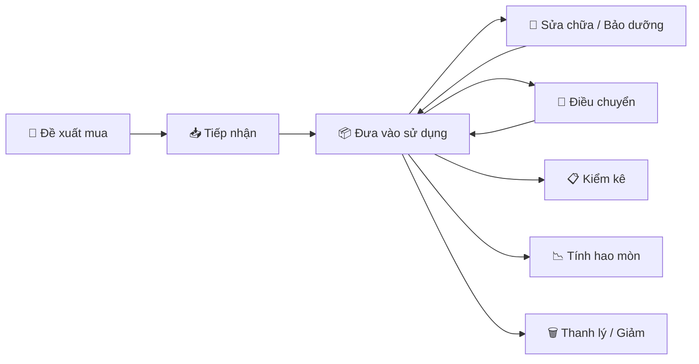

# 📦 Hướng dẫn sử dụng — Phần mềm Quản lý Tài sản (AMS Desk)

> **Phiên bản:** v1.8.4 · **Cập nhật:** 25/08/2026

## Chào mừng bạn đến với AMS Desk!

**AMS Desk** là phần mềm quản lý tài sản cố định và công cụ dụng cụ dành cho doanh nghiệp và bệnh viện. Phần mềm giúp bạn theo dõi toàn bộ vòng đời của tài sản — từ lúc đề xuất mua sắm, tiếp nhận, đưa vào sử dụng, sửa chữa, kiểm kê, điều chuyển cho đến khi thanh lý.

Tài liệu này sẽ hướng dẫn bạn sử dụng phần mềm một cách hiệu quả nhất.

---

## Phần mềm giúp bạn làm gì?

| Chức năng | Mô tả | Truy cập nhanh |
|-----------|-------|----------------|
| 📊 **Tổng quan** | Xem nhanh tình hình tài sản qua biểu đồ và thống kê | [Xem Dashboard](/docs/dashboard) |
| 🛒 **Đề xuất mua** | Tạo đề xuất mua sắm thiết bị mới, theo dõi trạng thái phê duyệt | [Đề xuất mua](/docs/acquisition) |
| 📦 **Tài sản cố định** | Quản lý tài sản: thêm, sửa, điều chuyển, sửa chữa, kiểm kê, tính hao mòn | [Quản lý tài sản](/docs/asset/asset-manage) |
| 🔧 **Công cụ dụng cụ** | Quản lý CCDC tương tự tài sản cố định | [Quản lý CCDC](/docs/tool/tool-manage) |
| 📈 **Báo cáo** | Xuất hơn 15 mẫu báo cáo dạng Excel | [Trung tâm báo cáo](/docs/report/report-center) |
| ⚙️ **Hệ thống** | Quản lý người dùng, gán quyền, danh mục và cấu hình | [Cấu hình](/docs/system/config) |

---

## Bạn thuộc nhóm nào?

Hệ thống phân quyền theo 4 vai trò chính. Mỗi vai trò sẽ thấy giao diện và chức năng khác nhau:

| Vai trò | Bạn có thể làm gì? | Phạm vi |
|---------|---------------------|---------|
| 🔴 **Giám đốc** | Phê duyệt các đề xuất và yêu cầu từ các phòng ban | Toàn bệnh viện/công ty |
| 🟡 **Trưởng phòng** | Quản lý tài sản thuộc phòng phụ trách, duyệt đơn liên quan | Phòng ban phụ trách |
| 🟢 **Kế toán tài sản** | Toàn quyền quản lý tài sản — thêm, sửa, xóa mà không cần chờ duyệt | Toàn hệ thống |
| 🔵 **Nhân viên** | Xem tài sản trong phòng mình, báo hỏng thiết bị | Phòng ban của mình |

:::tip Mẹo
Xem chi tiết bảng quyền hạn đầy đủ tại [Phụ lục — Bảng quyền hạn](/docs/appendix/role-permission-matrix).
:::

---

## Vòng đời tài sản

AMS Desk quản lý tài sản qua toàn bộ vòng đời, từ khi phát sinh nhu cầu đến khi thanh lý:

| Giai đoạn | Chức năng tương ứng | Tài liệu |
|-----------|---------------------|-----------|
| Đề xuất mua sắm | Đề xuất mua thiết bị | [Hướng dẫn](/docs/acquisition) |
| Tiếp nhận & Bàn giao | Tăng tài sản, gán phòng ban | [Quy trình](/docs/workflows/wf-reception-handover) |
| Sử dụng & Theo dõi | Quản lý tài sản, kiểm kê | [Quản lý](/docs/asset/asset-manage) |
| Sửa chữa & Bảo dưỡng | Lập phiếu sửa chữa, theo dõi | [Sửa chữa](/docs/asset/asset-maintenance) |
| Điều chuyển | Chuyển tài sản giữa phòng ban | [Điều chuyển](/docs/asset/asset-transfer) |
| Tính hao mòn | Tính khấu hao theo quy định | [Hao mòn](/docs/asset/depreciation) |
| Thanh lý / Giảm | Ghi nhận giảm tài sản | [Tăng giảm](/docs/asset/asset-increase-decrease) |

---

## Bắt đầu từ đâu?

Nếu bạn mới sử dụng phần mềm, hãy đọc theo thứ tự sau:

### 1️⃣ Chuẩn bị
- [Điều kiện tiên quyết](/docs/getting-started/prerequisites) — Yêu cầu hệ thống và cài đặt
- [Đăng nhập & Quên mật khẩu](/docs/getting-started/login) — Cách đăng nhập lần đầu

### 2️⃣ Làm quen giao diện
- [Tổng quan giao diện](/docs/getting-started/interface-overview) — Các thành phần chính trên màn hình
- [Dashboard](/docs/dashboard) — Bảng thống kê tổng quan

### 3️⃣ Sử dụng chức năng chính
- [Quản lý tài sản cố định](/docs/asset/asset-manage) — Thêm, sửa, xem tài sản
- [Quản lý công cụ dụng cụ](/docs/tool/tool-manage) — Tương tự tài sản cố định
- [Trung tâm báo cáo](/docs/report/report-center) — Xuất báo cáo Excel

### 4️⃣ Nắm quy trình nghiệp vụ
- [Tiếp nhận & Bàn giao](/docs/workflows/wf-reception-handover) — Quy trình đưa tài sản mới vào sử dụng
- [Sửa chữa, Bảo dưỡng](/docs/workflows/wf-maintenance) — Quy trình xử lý khi tài sản hỏng
- [Điều chuyển](/docs/workflows/wf-transfer) — Quy trình chuyển tài sản giữa phòng ban
- [Kiểm kê](/docs/workflows/wf-inventory) — Quy trình kiểm kê định kỳ

---

## Cần hỗ trợ?

- 📖 Xem [Câu hỏi thường gặp (FAQ)](/docs/appendix/faq) để tìm giải đáp nhanh
- 📎 Tham khảo [Bảng quyền hạn chi tiết](/docs/appendix/role-permission-matrix) để biết bạn được làm gì
- 📧 Liên hệ quản trị viên hệ thống nếu gặp vấn đề về tài khoản hoặc phân quyền
