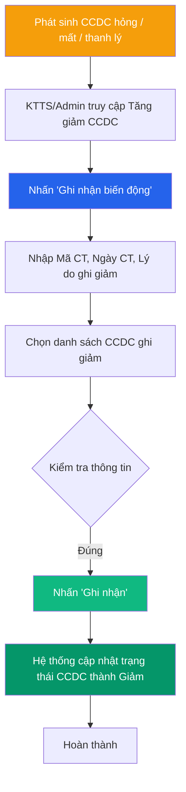

# 📈 Tăng giảm Công cụ dụng cụ (CCDC)

> **Đường dẫn:** Menu bên trái → Công cụ dụng cụ → Tăng giảm
>
> **Quyền truy cập:** Yêu cầu quyền `asset-change:readAll`

---

## Màn hình chính

Trang quản lý các biến động tăng và giảm công cụ dụng cụ (CCDC) trong kỳ. Giao diện và quy trình xử lý tương tự như [Tăng giảm Tài sản cố định](../asset/asset-increase-decrease.md), được tối ưu hóa cho CCDC.

### Thẻ thống kê tổng quan

| Thẻ | Mô tả |
|-----|-------|
| **Tổng số biến động** | Tổng số phiếu ghi nhận tăng/giảm CCDC trong kỳ |
| **Tổng biến động TĂNG** | Tổng phiếu ghi tăng CCDC (mua mới, cấp phát, nhận bàn giao) |
| **Tổng biến động GIẢM** | Tổng phiếu ghi giảm CCDC (báo hỏng hoàn toàn, báo mất, thanh lý) |

### Bảng danh sách

| Cột | Mô tả |
|-----|-------|
| **Mã chứng từ** | Mã phiếu ghi nhận CCDC (VD: `TG-2608-xxxx`) |
| **Ngày chứng từ** | Ngày lập phiếu |
| **Loại biến động** | Nhãn **Tăng** (màu xanh green/blue) hoặc **Giảm** (màu cam/đỏ) |
| **Lý do biến động** | Lý do (Loại bỏ, Báo hỏng, Thu hồi, Cấp phát...) |
| **Số lượng CCDC** | Số lượng CCDC phát sinh biến động |
| **Tổng giá trị** | Tổng giá trị CCDC (VNĐ) |
| **Thao tác** | Nút `⋮` cho phép **Xem chi tiết** phiếu ghi nhận |

---

## Quy trình Ghi nhận biến động GIẢM CCDC (KTTS/Admin)

Chức năng **Ghi giảm CCDC** được dùng khi CCDC bị hỏng không thể dùng tiếp, báo mất, thanh lý hoặc tiêu hủy.

### Bước 1 — Mở form ghi nhận biến động CCDC

1. Truy cập **Công cụ dụng cụ → Tăng giảm**.
2. Nhấn nút **"Ghi nhận biến động"** ở góc trên bên phải.

### Bước 2 — Nhập thông tin chứng từ

| Trường | Bắt buộc | Mô tả |
|--------|:--------:|-------|
| **Mã chứng từ** | ✅ | Mã tự sinh hoặc nhập thủ công |
| **Ngày chứng từ** | ✅ | Ngày ghi nhận biến động |
| **Lý do ghi giảm** | ✅ | Chọn lý do: *Hư hỏng hoàn toàn, Báo mất, Loại bỏ, Thanh lý, Tiêu hủy...* |
| **Hình thức xử lý** | ❌ | Chọn hình thức xử lý CCDC |
| **Ghi chú** | ❌ | Diễn giải nguyên nhân chi tiết |

### Bước 3 — Chọn CCDC ghi giảm

1. Nhấn nút **"+ Chọn công cụ dụng cụ"**.
2. Tích chọn một hoặc nhiều CCDC cần ghi nhận giảm.
3. Xác nhận để lưu chứng từ.

---

## Luồng xử lý Ghi giảm CCDC

---

## Ai được làm gì?

| Thao tác | 🟢 Kế toán TS | 🔴 Giám đốc | 🟡 Trưởng phòng | 🔵 Nhân viên |
|----------|:--------------:|:-----------:|:---------------:|:------------:|
| Xem danh sách biến động | ✅ Toàn bộ | ✅ Toàn bộ | ✅ Phòng phụ trách | ✅ Phòng mình |
| Xem chi tiết chứng từ | ✅ | ✅ | ✅ | ✅ |
| Ghi nhận biến động (Tăng/Giảm) | ✅ | ❌ | ❌ | ❌ |
| Xuất danh sách Excel | ✅ | ✅ | ✅ | ❌ |

> 📖 Tham khảo thêm chi tiết tại [Tăng giảm Tài sản cố định](../asset/asset-increase-decrease.md).
