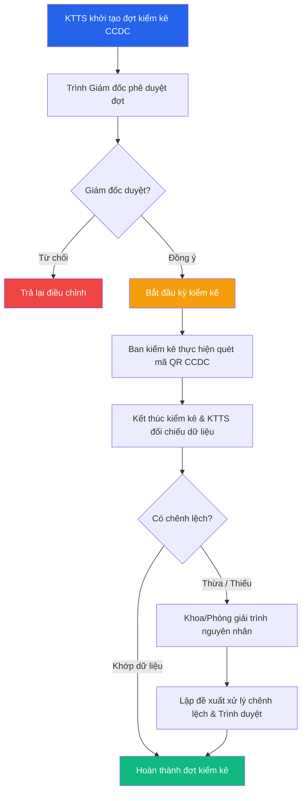

# 📋 Kiểm kê Công cụ dụng cụ (CCDC)

> **Đường dẫn:** Menu bên trái → Công cụ dụng cụ → Kiểm kê
>
> **Quyền truy cập:** Yêu cầu quyền `inventory-session:readAll`

---

## Màn hình chính

Chức năng **Kiểm kê CCDC** giúp đối chiếu số lượng CCDC thực tế tại các khoa/phòng ban với dữ liệu trên phần mềm quản lý, từ đó phát hiện chênh lệch (thừa/thiếu/hư hỏng) và đưa ra phương án xử lý phù hợp.

---

## Thanh công cụ & Bộ lọc

| Thành phần | Mô tả |
|------------|-------|
| **➕ Thêm đợt kiểm kê** | Mở form tạo đợt/kỳ kiểm kê CCDC mới |
| **🔍 Tìm kiếm** | Tìm theo mã đợt, tên đợt kiểm kê |
| **Trạng thái** | Lọc theo: *Chờ duyệt / Đang kiểm kê / Đã kết thúc / Đã hủy* |

---

## Bảng danh sách đợt kiểm kê CCDC

| Cột | Mô tả |
|-----|-------|
| **Mã đợt kiểm kê** | Mã đợt (VD: `KK-2026-3856`) |
| **Tên đợt kiểm kê** | Tên kỳ kiểm kê (VD: *Kiểm kê CCDC định kỳ Quý 3*) |
| **Từ ngày — Đến ngày** | Khoảng thời gian thực hiện đợt kiểm kê |
| **Phạm vi kiểm kê** | Tất cả đơn vị hoặc khoa/phòng ban cụ thể |
| **Ban kiểm kê** | Danh sách nhân viên/cán bộ tham gia kiểm kê |
| **Trạng thái** | Trạng thái đợt kiểm kê (*Đang kiểm kê*, *Đã kết thúc*) |
| **Thao tác** | Nút `⋮` mở menu (*Chi tiết đợt*, *Phê duyệt*, *Thực hiện kiểm kê*) |

---

## Quy trình Kiểm kê CCDC

### Bước 1 — Khởi tạo đợt kiểm kê (KTTS/Admin)

1. Truy cập **Công cụ dụng cụ → Kiểm kê**.
2. Nhấn nút **"Thêm đợt kiểm kê"**.
3. Điền thông tin trong form:

| Trường | Bắt buộc | Mô tả |
|--------|:--------:|-------|
| **Mã kiểm kê** | ✅ | Hệ thống tự động sinh mã (VD: `KK-2026-3856`) |
| **Tên đợt kiểm kê** | ✅ | Nhập tên đợt kiểm kê (VD: *Kiểm kê CCDC Tổng kho*) |
| **Từ ngày / Đến ngày** | ✅ | Khoảng thời gian cho phép thực hiện kiểm kê |
| **Phạm vi kiểm kê (Phòng ban)** | ✅ | Chọn phòng ban cụ thể hoặc *Tất cả các phòng* |
| **Ban kiểm kê (Chọn nhân viên)** | ✅ | Chọn các thành viên tham gia tổ kiểm kê |
| **Ghi chú** | ❌ | Ghi chú các yêu cầu đặc biệt |

4. Nhấn **"Thêm mới"** để hoàn tất đợt kiểm kê.

### Bước 2 — Phê duyệt đợt kiểm kê

- **Giám đốc** xem xét và duyệt đợt kiểm kê để chính thức bắt đầu kỳ kiểm kê.

### Bước 3 — Thực hiện quét mã QR CCDC thực tế

1. Cán bộ/nhân viên thuộc ban kiểm kê đăng nhập phần mềm trên máy tính hoặc ứng dụng di động.
2. Mở đợt kiểm kê đang diễn ra → Sử dụng chức năng **Quét QR** để quét mã tem dán trên từng CCDC.
3. Hệ thống tự động đánh dấu CCDC là **"Đã kiểm kê"** và ghi nhận thời gian quét.
4. *Nếu phát hiện CCDC chưa có tem/chưa có trên phần mềm:* Nhân viên nhập bổ sung thông tin CCDC chờ xác nhận.

### Bước 4 — Xác nhận kết thúc & Đối chiếu dữ liệu

1. Sau khi hoàn thành quét tại các phòng ban, Trưởng ban kiểm kê nhấn **"Kết thúc kiểm kê"**.
2. KTTS tiến hành **Đối chiếu dữ liệu**:
   - **Khớp:** Xác nhận hoàn tất đợt kiểm kê.
   - **Thừa CCDC:** CCDC có thực tế nhưng không có trên sổ → Yêu cầu khoa/phòng giải trình & ghi tăng.
   - **Thiếu CCDC:** CCDC trên sổ có nhưng thực tế không thấy → Yêu cầu giải trình & lập biên bản đền bù/ghi giảm.

### Bước 5 — Xử lý chênh lệch & Lập báo cáo

KTTS tổng hợp **Báo cáo kết quả kiểm kê CCDC** và đề xuất phương án xử lý chênh lệch trình Giám đốc phê duyệt.

---

## Luồng xử lý Kiểm kê CCDC

---

## Phân quyền Kiểm kê CCDC

| Thao tác | 🟢 Kế toán TS | 🔴 Giám đốc | 🟡 Trưởng phòng | 🔵 Nhân viên |
|----------|:--------------:|:-----------:|:---------------:|:------------:|
| Tạo đợt kiểm kê | ✅ | ❌ | ❌ | ❌ |
| Phê duyệt đợt kiểm kê | ✅ | ✅ | ❌ | ❌ |
| Thực hiện quét QR kiểm kê | ✅ | ❌ | ✅ (phòng mình) | ✅ (phòng mình) |
| Kết thúc kiểm kê | ✅ | ❌ | ✅ (phòng mình) | ❌ |
| Đối chiếu & Xử lý chênh lệch | ✅ | ❌ | ❌ | ❌ |
