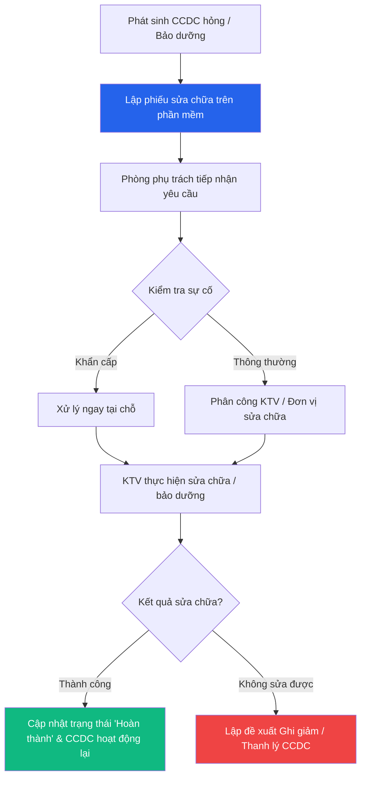

# 🔧 Sửa chữa & Bảo dưỡng CCDC

> **Đường dẫn:** Menu bên trái → Công cụ dụng cụ → Sửa chữa & Bảo dưỡng
>
> **Quyền truy cập:** Yêu cầu quyền `asset:readAll`

---

## Màn hình chính

Chức năng **Sửa chữa & Bảo dưỡng CCDC** quản lý toàn bộ vòng đời xử lý sự cố từ khi phát sinh yêu cầu sửa chữa CCDC hỏng, kiểm tra, phân công kỹ thuật viên, thực hiện sửa chữa đến khi cập nhật hoàn thành.

---

## Thanh công cụ & Bộ lọc

| Thành phần | Mô tả |
|------------|-------|
| **➕ Lập phiếu sửa chữa** | Mở form tạo mới phiếu yêu cầu sửa chữa/bảo dưỡng CCDC |
| **🔍 Tìm kiếm** | Tìm theo mã phiếu, tên CCDC, nội dung sự cố |
| **Loại yêu cầu** | Lọc theo: *Sửa chữa / Bảo dưỡng định kỳ* |
| **Mức ưu tiên** | Lọc theo: *Thấp / Trung bình / Cao / Khẩn cấp* |
| **Trạng thái** | Lọc theo: *Chờ tiếp nhận / Đang xử lý / Hoàn thành / Không sửa được* |

---

## Bảng danh sách phiếu sửa chữa CCDC

| Cột | Mô tả |
|-----|-------|
| **Mã phiếu** | Mã phiếu sửa chữa (VD: `SC-2608-xxxx`) |
| **Phòng ban yêu cầu** | Khoa/Phòng đang sử dụng CCDC báo hỏng |
| **Danh sách CCDC** | Tên CCDC cần sửa chữa/bảo dưỡng |
| **Loại yêu cầu** | Sửa chữa hoặc Bảo dưỡng |
| **Mức ưu tiên** | Mức độ cấp thiết của sự cố |
| **Trạng thái** | Trạng thái tiến độ xử lý sự cố |
| **Ngày tạo** | Ngày gửi yêu cầu |
| **Thao tác** | Nút `⋮` mở menu (*Xem chi tiết*, *Phân công KTV*, *Cập nhật kết quả*) |

---

## Quy trình Sửa chữa & Bảo dưỡng CCDC

### Bước 1 — Phát sinh yêu cầu sửa chữa

Khi CCDC bị hỏng hoặc đến kỳ bảo dưỡng:
1. Nhân viên hoặc đại diện phòng ban quét mã QR trên CCDC hoặc truy cập **Công cụ dụng cụ → Sửa chữa & Bảo dưỡng**.
2. Nhấn nút **"Lập phiếu sửa chữa"**.

### Bước 2 — Nhập thông tin phiếu sửa chữa CCDC

Trong form **Thêm mới phiếu sửa chữa / bảo dưỡng**:

| Trường | Bắt buộc | Mô tả |
|--------|:--------:|-------|
| **Mã phiếu** | ✅ | Mã phiếu tự sinh (VD: `SC-2608-7003`) |
| **Phòng ban yêu cầu** | ✅ | Chọn khoa/phòng ban yêu cầu sửa chữa |
| **Tài sản / CCDC cần sửa** | ✅ | Nhấn **"+ Chọn tài sản"** để chọn CCDC hỏng |
| **Loại yêu cầu** | ✅ | Chọn *Sửa chữa sự cố* hoặc *Bảo dưỡng định kỳ* |
| **Mức ưu tiên** | ✅ | Chọn *Thấp*, *Trung bình*, *Cao*, hoặc *Khẩn cấp* |
| **Mô tả sự cố / Vấn đề** | ✅ | Nhập mô tả chi tiết hiện tượng hư hỏng, sự cố cần xử lý |

Nhấn **"Thêm mới"** để gửi yêu cầu.

### Bước 3 — Tiếp nhận & Phân công kỹ thuật viên (KTV)

1. Trưởng phòng VT-TB / HCQT / CNTT tiếp nhận phiếu yêu cầu.
2. Kiểm tra hiện trạng CCDC và phân công KTV (hoặc đơn vị bảo trì bên ngoài) thực hiện.

### Bước 4 — Thực hiện sửa chữa / bảo dưỡng

- **Sửa chữa tại chỗ:** KTV tiến hành khắc phục sự cố tại khoa/phòng.
- **Sửa chữa ngoài:** Gửi CCDC cho đơn vị cung cấp dịch vụ bảo hành/sửa chữa.

### Bước 5 — Cập nhật kết quả & Hoàn thành

1. Sau khi hoàn thành, KTV cập nhật trạng thái phiếu thành **Hoàn thành**.
2. CCDC được khôi phục trạng thái **Đang sử dụng**.
3. *Trường hợp CCDC hỏng nặng không sửa được:* KTV báo cáo để chuyên sang quy trình **Ghi giảm / Thanh lý CCDC**.

---

## Luồng xử lý Sửa chữa & Bảo dưỡng CCDC

---

## Phân quyền Sửa chữa CCDC

| Thao tác | 🟢 Kế toán TS | 🔴 Giám đốc | 🟡 Trưởng phòng | 🔵 KTV / Nhân viên |
|----------|:--------------:|:-----------:|:---------------:|:------------------:|
| Xem danh sách phiếu | ✅ Toàn bộ | ✅ Toàn bộ | ✅ (phòng phụ trách) | ✅ (phòng mình) |
| Tạo phiếu sửa chữa | ✅ (tự duyệt) | ✅ | ✅ | ✅ |
| Phê duyệt & Phân công | ✅ | ✅ | ✅ (phòng phụ trách) | ❌ |
| Thực hiện & Cập nhật kết quả | ✅ | ❌ | ✅ | ✅ (KTV) |
