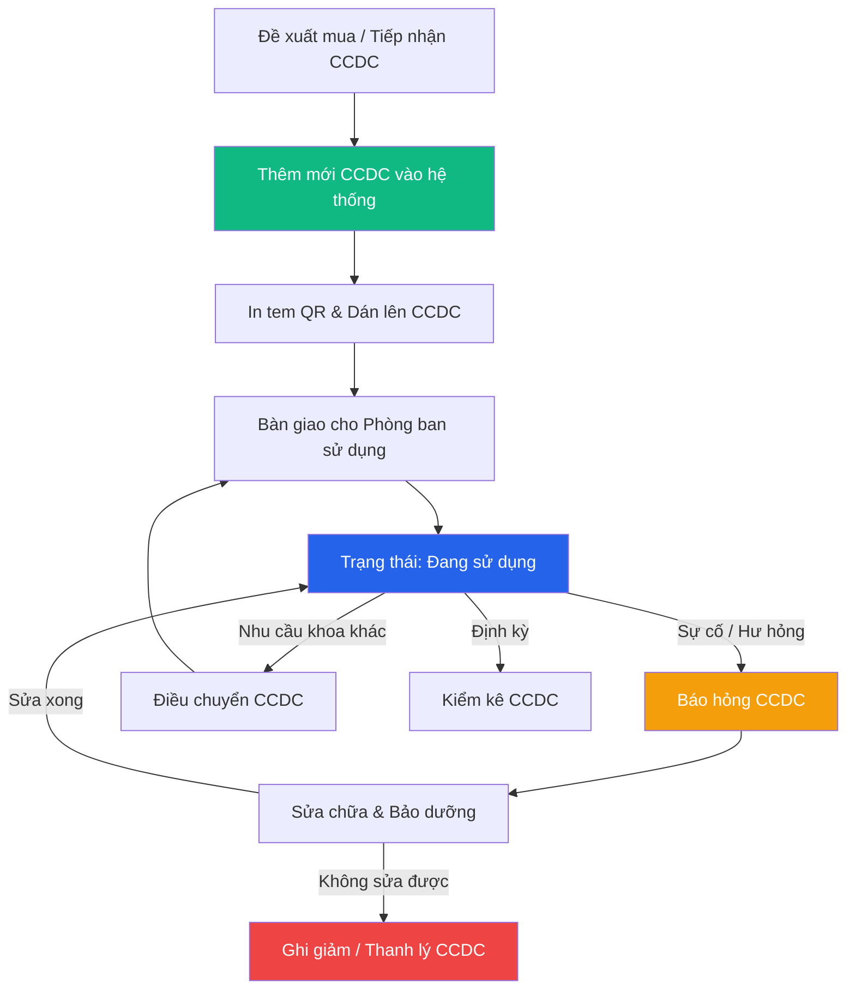

# 🔧 Quản lý Công cụ dụng cụ (CCDC)

> **Đường dẫn:** Menu bên trái → Công cụ dụng cụ → Quản lý
>
> **Quyền truy cập:** Yêu cầu quyền `asset:readAll`

---

## Màn hình chính

Trang **Quản lý CCDC** cho phép ghi nhận, theo dõi và quản lý danh mục công cụ dụng cụ trong toàn bộ doanh nghiệp/bệnh viện.

> **Đặc điểm CCDC khác với Tài sản cố định (TSCĐ):**
> - Nguyên giá / Giá trị thấp hơn tiêu chuẩn TSCĐ (dưới 30 triệu VNĐ hoặc theo quy định đơn vị).
> - **Không trích khấu hao / tính hao mòn hàng năm** trên hệ thống.
> - **Không phân loại sổ kế toán** (không chia sổ tài sản/tài chính).
> - Phân bổ chi phí theo kỳ sử dụng hoặc phân bổ 100% khi xuất dùng.

---

## Thanh công cụ & Bộ lọc

### Thanh công cụ

| Nút | Chức năng |
|-----|----------|
| **➕ Thêm CCDC** | Mở form tạo mới công cụ dụng cụ (yêu cầu quyền `asset:create`) |
| **📥 Nhập Excel** | Import danh sách CCDC từ file Excel mẫu |
| **🔄 Tải lại** | Làm mới dữ liệu và đặt lại bộ lọc |

### Tìm kiếm và lọc

| Ô lọc | Mô tả |
|-------|-------|
| **Tên CCDC** | Tìm kiếm theo tên công cụ dụng cụ (gõ từ khóa + Enter) |
| **Mã CCDC** | Tìm kiếm theo mã định danh duy nhất (VD: `CCDC-2608-xxxx`) |
| **Trạng thái** | Lọc theo: *Tất cả / Đang sử dụng / Đang sửa chữa / Hư hỏng / Đã thanh lý* |
| **🔍 Lọc nâng cao** | Lọc mở rộng theo *Phòng ban quản lý, Phòng ban sử dụng, Nhà cung cấp* |
| **📷 Quét QR** | Quét mã QR dán trên CCDC để tra cứu nhanh |

---

## Bảng dữ liệu CCDC

| Cột | Mô tả |
|-----|-------|
| **STT** | Số thứ tự dòng dữ liệu |
| **Mã CCDC** | Mã định danh duy nhất của công cụ dụng cụ |
| **Tên CCDC** | Tên đầy đủ của CCDC |
| **Số lượng** | Số lượng hiện có |
| **Nguyên giá** | Giá trị ban đầu khi đưa vào sử dụng (VNĐ) |
| **Ngày ghi tăng** | Ngày ghi nhận CCDC vào hệ thống |
| **Phòng ban quản lý** | Phòng ban chịu trách nhiệm quản lý chung |
| **Phòng ban sử dụng** | Phòng ban/Khoa đang trực tiếp sử dụng |
| **Trạng thái** | Trạng thái sử dụng hiện tại |
| **Mô tả** | Ghi chú hoặc thông số chi tiết |
| **Thao tác** | Nút `⋮` mở menu thao tác nhanh cho từng CCDC |

---

## Hướng dẫn thao tác chi tiết

### 1. Thêm mới Công cụ dụng cụ

1. Nhấn nút **"➕ Thêm CCDC"** trên thanh công cụ.
2. Điền các trường thông tin trong form:
   - **Tên CCDC** *(Bắt buộc)*: Tên chi tiết của CCDC.
   - **Đơn vị tính** *(Bắt buộc)*: Cái, Bộ, Chiếc, Hộp...
   - **Số lượng** *(Bắt buộc)*: Số lượng nhập.
   - **Nguyên giá** *(Bắt buộc)*: Đơn giá / tổng giá trị ban đầu.
   - **Phòng ban quản lý & Phòng ban sử dụng** *(Bắt buộc)*: Chọn phòng ban chịu trách nhiệm.
   - **Hãng sản xuất / Model / Serial**: Nhập nếu có.
3. Nhấn **"Thêm mới"** để hoàn tất CCDC vào hệ thống.

### 2. Xem chi tiết & Lịch sử thao tác

1. Tại dòng CCDC tương ứng, nhấn nút `⋮` → chọn **"Xem chi tiết"**.
2. Hệ thống hiển thị popup xem chi tiết thông tin CCDC (chế độ chỉ đọc).
3. Khi click chọn một dòng CCDC trong bảng, phần bên dưới sẽ hiển thị **Lịch sử thao tác (lịch sử thao tác)** ghi lại toàn bộ quá trình biến động, sửa chữa, điều chuyển của CCDC đó.

### 3. Sửa thông tin CCDC

1. Click nút `⋮` trên dòng CCDC → chọn **"Chỉnh sửa"** (yêu cầu quyền `asset:update`).
2. Cập nhật các thông tin cần thay đổi (Tên, Phòng ban, Mô tả...).
3. Nhấn **"Lưu thay đổi"**.

### 4. Báo hỏng CCDC

1. Khi CCDC gặp sự cố, nhân viên hoặc Trưởng phòng click nút `⋮` → chọn **"Báo hỏng"**.
2. Nhập **Lý do báo hỏng** và **Ghi chú kỹ thuật**.
3. Nhấn **"Gửi báo cáo"** — CCDC được chuyển trạng thái thành `Hư hỏng` và tự động tạo đề xuất sửa chữa/bảo dưỡng.

### 5. In mã QR / Quét mã QR CCDC

1. Click nút `⋮` → chọn **"Xem mã QR"**.
2. Hệ thống hiển thị mã QR chứa thông tin Mã CCDC, Tên CCDC và Phòng ban.
3. Nhấn **"In mã QR"** để in tem dán lên CCDC thực tế.
4. Khi kiểm kê hoặc tra cứu, sử dụng tính năng **"📷 Quét QR"** trên thanh công cụ để quét tem.

### 6. Import danh sách CCDC từ Excel

1. Nhấn nút **"📥 Nhập Excel"** trên thanh công cụ.
2. Tải file mẫu `.xlsx` do hệ thống cung cấp.
3. Nhập danh sách CCDC vào file Excel theo đúng cấu trúc cột.
4. Kéo thả hoặc chọn file Excel để tải lên → Nhấn **"Xác nhận"**.

---

## Vòng đời Công cụ dụng cụ

---

## Ai được làm gì — Quản lý CCDC

| Thao tác | 🟢 Kế toán TS | 🔴 Giám đốc | 🟡 Trưởng phòng | 🔵 Nhân viên |
|----------|:--------------:|:-----------:|:---------------:|:------------:|
| Xem danh sách CCDC | ✅ | ✅ | ✅ (phòng phụ trách) | ✅ (phòng mình) |
| Thêm mới CCDC | ✅ | ❌ | ❌ | ❌ |
| Chỉnh sửa CCDC | ✅ | ❌ | ❌ | ❌ |
| Xóa CCDC | ✅ | ❌ | ❌ | ❌ |
| Báo hỏng CCDC | ✅ | ✅ | ✅ | ✅ |
| In / Quét QR | ✅ | ✅ | ✅ | ✅ |
| Import Excel | ✅ | ❌ | ❌ | ❌ |
| Xem lịch sử (lịch sử thao tác) | ✅ | ✅ | ✅ | ✅ (phòng mình) |
