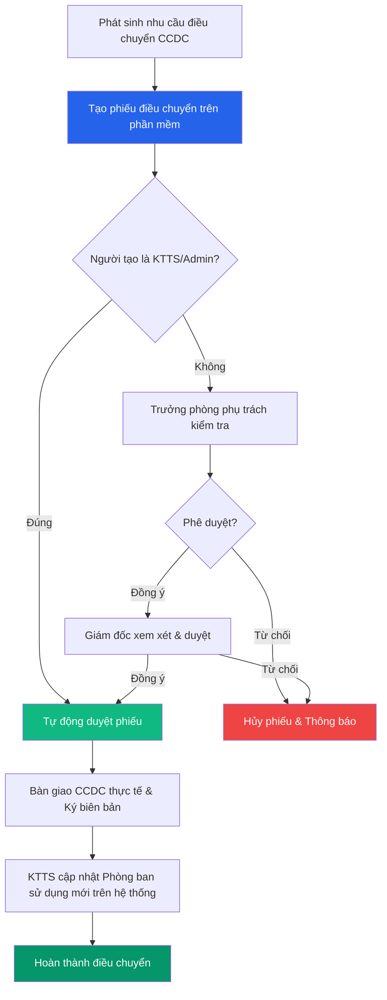

# 🔄 Điều chuyển Công cụ dụng cụ (CCDC)

> **Đường dẫn:** Menu bên trái → Công cụ dụng cụ → Điều chuyển
>
> **Quyền truy cập:** Yêu cầu quyền `transfer:readAll`

---

## Màn hình chính

Chức năng **Điều chuyển CCDC** cho phép quản lý toàn bộ quá trình luân chuyển CCDC từ khoa/phòng ban này sang khoa/phòng ban khác trong nội bộ đơn vị.

---

## Thanh công cụ & Bộ lọc

| Thành phần | Mô tả |
|------------|-------|
| **➕ Tạo phiếu điều chuyển** | Mở form khởi tạo phiếu điều chuyển CCDC mới |
| **🔍 Tìm kiếm** | Tìm theo mã phiếu, lý do hoặc phòng ban |
| **Từ ngày / Đến ngày** | Lọc danh sách phiếu theo khoảng thời gian tạo |
| **Trạng thái** | Lọc theo: *Tất cả / Chờ duyệt / Đã duyệt / Từ chối / Đã hoàn thành* |

---

## Bảng danh sách phiếu điều chuyển

| Cột | Mô tả |
|-----|-------|
| **Mã phiếu** | Mã định danh duy nhất của phiếu điều chuyển (VD: `DC-2608-xxxx`) |
| **Ngày điều chuyển** | Ngày dự kiến hoặc ngày thực hiện điều chuyển |
| **Phòng ban giao** | Khoa/Phòng đang quản lý CCDC thực tế |
| **Phòng ban nhận** | Khoa/Phòng dự kiến tiếp nhận CCDC |
| **Số lượng CCDC** | Tổng số lượng CCDC trong phiếu |
| **Trạng thái phê duyệt** | Nhãn màu thể hiện trạng thái (*Chờ duyệt*, *Đã duyệt*, *Từ chối*) |
| **Người tạo** | Tài khoản lập phiếu điều chuyển |
| **Thao tác** | Nút `⋮` mở menu thao tác (*Xem chi tiết*, *Phê duyệt*, *Xuất biên bản*) |

---

## Quy trình Điều chuyển CCDC

### Bước 1 — Phát sinh nhu cầu điều chuyển

Căn cứ nhu cầu sử dụng thực tế giữa các khoa/phòng, nhân viên hoặc Trưởng phòng tạo yêu cầu điều chuyển CCDC trên phần mềm.

1. Truy cập **Công cụ dụng cụ → Điều chuyển**.
2. Nhấn nút **"Tạo phiếu điều chuyển"**.

### Bước 2 — Lập phiếu điều chuyển CCDC

Trong form **Thêm mới điều chuyển**:

| Trường | Bắt buộc | Mô tả |
|--------|:--------:|-------|
| **Mã điều chuyển** | ✅ | Hệ thống tự động sinh mã (VD: `DC-2608-8432`) |
| **Ngày điều chuyển** | ✅ | Chọn ngày thực hiện điều chuyển |
| **Chọn phòng ban nhận chung** | ❌ | Chọn phòng ban nhận áp dụng cho tất cả CCDC trong phiếu |
| **Danh sách CCDC** | ✅ | Nhấn **"+ Chọn công cụ dụng cụ"** để tích chọn danh sách CCDC cần chuyển |
| **Ghi chú (Ý kiến phê duyệt)** | ❌ | Nhập lý do điều chuyển hoặc chỉ đạo đặc biệt |

Nhấn **"Thêm mới"** để gửi phiếu vào hệ thống.

### Bước 3 — Phê duyệt phiếu điều chuyển

Quy tắc phê duyệt phiếu điều chuyển CCDC:

- 🟢 **Kế toán tài sản (KTTS) / Admin:** Khi tạo phiếu thì **tự động duyệt**, không cần qua cấp phê duyệt.
- 🟡 **Trưởng phòng phụ trách (VT-TB / HCQT / CNTT):** Kiểm tra nội dung yêu cầu, chọn cán bộ phụ trách và duyệt phiếu thuộc phạm vi phòng mình.
- 🔴 **Giám đốc:** Phê duyệt cuối cùng đối với tất cả phiếu điều chuyển.

*Nếu không duyệt:* Phiếu bị chuyển trạng thái **Từ chối** kèm lý do từ chối.

### Bước 4 — Thực hiện bàn giao thực tế

1. Sau khi phiếu được duyệt, bộ phận phụ trách phối hợp giữa phòng giao và phòng nhận thực hiện bàn giao CCDC thực tế.
2. Hai bên lập **Biên bản điều chuyển CCDC** (BM.05.TC.05.01) và ký xác nhận.

### Bước 5 — KTTS Cập nhật hệ thống

KTTS xác nhận hoàn thành phiếu trên phần mềm. Hệ thống tự động cập nhật **Phòng ban sử dụng mới** cho toàn bộ CCDC trong danh sách.

---

## Luồng xử lý điều chuyển CCDC

---

## Phân quyền Điều chuyển CCDC

| Thao tác | 🟢 Kế toán TS | 🔴 Giám đốc | 🟡 Trưởng phòng | 🔵 Nhân viên |
|----------|:--------------:|:-----------:|:---------------:|:------------:|
| Xem danh sách phiếu | ✅ Toàn bộ | ✅ Toàn bộ | ✅ (phòng phụ trách) | ✅ (phòng mình) |
| Tạo phiếu điều chuyển | ✅ (tự duyệt) | ✅ | ✅ | ✅ |
| Phê duyệt phiếu | ✅ | ✅ | ✅ (phòng phụ trách) | ❌ |
| In / Xuất biên bản | ✅ | ✅ | ✅ | ❌ |
| Cập nhật hoàn thành | ✅ | ❌ | ❌ | ❌ |
