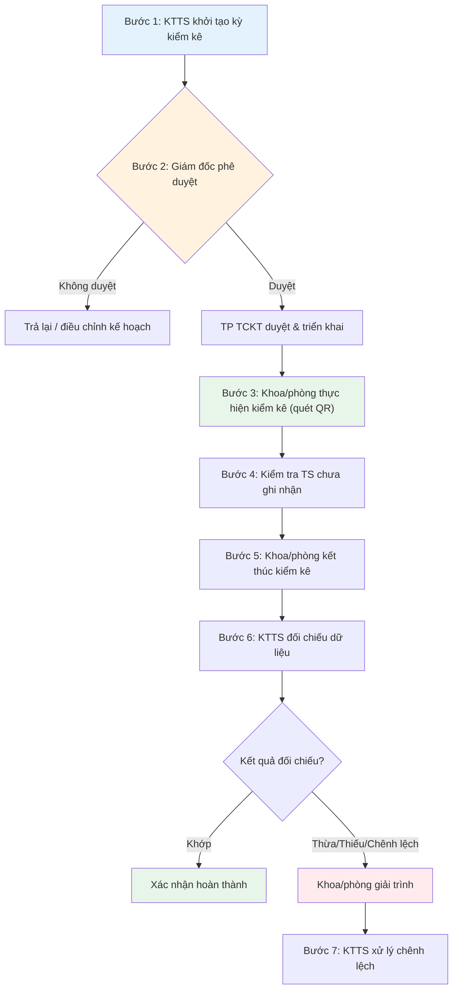

# 📋 Quy trình 4: Kiểm kê tài sản

> **Mục đích:** Đối chiếu tài sản thực tế với dữ liệu đang được quản lý trên hệ thống và xử lý chênh lệch.
>
> **Tác nhân:** KTTS, Giám đốc, TCKT, Khoa/phòng.
>
> **Tài liệu gốc:** Mục 5.4.

---

## Sơ đồ quy trình

---

## Chi tiết từng bước

### Bước 1 – Khởi tạo kỳ kiểm kê

Khi đến kỳ kiểm kê (theo tháng, quý hoặc kiểm kê đột xuất), KTTS tạo kỳ kiểm kê trên phần mềm.

**Thao tác trên phần mềm:**
- Vào mục **Kiểm kê** → **"➕ Tạo kỳ kiểm kê"**.
- Nhập tên, thời gian, phạm vi.
- Chọn thành viên tham gia kiểm kê.

### Bước 2 – Phê duyệt kỳ kiểm kê

Giám đốc xem xét:
- **Không duyệt** → Trả lại/điều chỉnh kế hoạch.
- **Duyệt** → Trưởng phòng TCKT duyệt và triển khai kiểm kê.

### Bước 3 – Thực hiện kiểm kê

Khoa/phòng thực hiện kiểm kê bằng cách:
1. Đăng nhập ứng dụng/phần mềm.
2. **Quét QR Code** gắn trên từng máy móc, trang thiết bị.
3. Ghi nhận tình trạng thực tế của tài sản.

### Bước 4 – Kiểm tra tài sản chưa ghi nhận

Trong quá trình kiểm kê, nếu phát hiện tài sản **chưa có mã máy/mã tài sản**, khoa/phòng cập nhật thông tin theo hướng dẫn của KTTS.

### Bước 5 – Xác nhận kết quả

Sau khi hoàn thành quét tất cả tài sản, khoa/phòng nhấn **"Kết thúc kiểm kê"**.

### Bước 6 – Đối chiếu dữ liệu

KTTS đối chiếu kết quả kiểm kê thực tế với dữ liệu quản lý tài sản:
- **Khớp** → Xác nhận hoàn thành.
- **Thừa/Thiếu/Chênh lệch** → Khoa/phòng thực hiện giải trình.

### Bước 7 – Xử lý chênh lệch

KTTS tổng hợp báo cáo kiểm kê và đề xuất phương án xử lý đối với tài sản thừa, thiếu hoặc sai lệch.

---

## Kết quả

Có kết quả kiểm kê chính thức và xác định được các chênh lệch giữa tài sản thực tế và dữ liệu quản lý.
