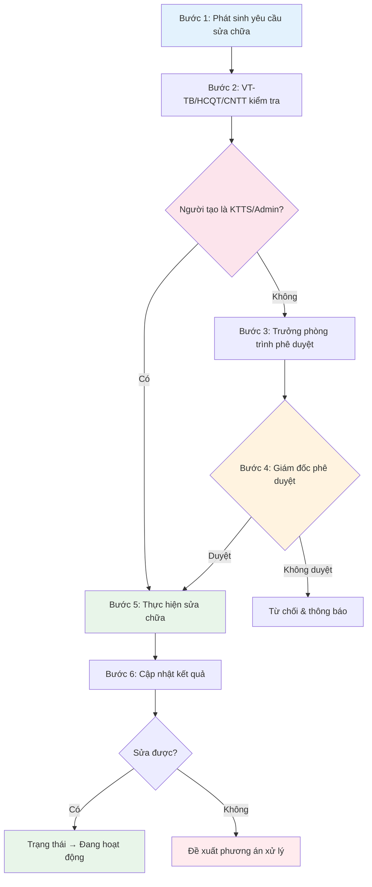

# 🔧 Quy trình 2: Sửa chữa, Bảo dưỡng tài sản

> **Mục đích:** Quản lý yêu cầu sửa chữa/bảo dưỡng từ khi phát sinh đến khi hoàn thành.
>
> **Tác nhân:** Khoa/phòng sử dụng, VT-TB/HCQT/CNTT, KTTS, Giám đốc.
>
> **Tài liệu gốc:** Mục 5.2, trang 7.

---

## Sơ đồ quy trình

---

## Chi tiết từng bước

### Bước 1 – Phát sinh yêu cầu

Khi tài sản hỏng/cần sửa chữa, khoa/phòng tạo yêu cầu sửa chữa/bảo dưỡng.

**Thao tác trên phần mềm:**
- **Cách 1:** Vào mục **Sửa chữa & Bảo dưỡng** → **"➕ Tạo yêu cầu"**.
- **Cách 2:** Quét **QR Code** trên thiết bị → chọn **"Báo hỏng"**.
- Nhập tình trạng hỏng và lý do.

### Bước 2 – Tiếp nhận và kiểm tra

Bộ phận VT-TB/HCQT/CNTT kiểm tra tình trạng tài sản và nội dung đề nghị.

**Thao tác trên phần mềm:** Trưởng phòng VT-TB/HCQT/CNTT xem đơn yêu cầu trong mục **Sửa chữa & Bảo dưỡng**.

### Bước 3 – Trình phê duyệt

Trưởng phòng phụ trách lựa chọn người thực hiện và trình cấp có thẩm quyền phê duyệt.

> **Trường hợp cấp thiết:** Khoa/phòng có thể liên hệ trực tiếp để được xử lý kịp thời.

**Thao tác trên phần mềm:** Trưởng phòng nhấn **"Phê duyệt"** → chọn người thực hiện → trình Giám đốc.

### Bước 4 – Xử lý quyết định

- **Không duyệt** → Kết thúc/từ chối yêu cầu và thông báo lại khoa/phòng.
- **Được duyệt** → Chuyển sang sửa chữa/bảo dưỡng.

> ⚡ **Luồng KTTS/Admin:** Bỏ qua Bước 3 và 4 → Chuyển thẳng sang Bước 5.

### Bước 5 – Thực hiện sửa chữa/bảo dưỡng

Cán bộ được phân công thực hiện hoặc phối hợp đơn vị cung cấp dịch vụ.

### Bước 6 – Cập nhật kết quả

Sau khi hoàn thành:
- **Sửa được** → Cập nhật trạng thái thành **"Đang hoạt động"**.
- **Không sửa được** → Đánh giá và đề xuất phương án xử lý theo quy định.

**Thao tác trên phần mềm:** Nhấn **"Cập nhật kết quả"** trong phiếu sửa chữa.

---

## Kết quả

Tài sản được khôi phục hoạt động hoặc được chuyển sang quy trình xử lý phù hợp nếu không thể sửa chữa.
