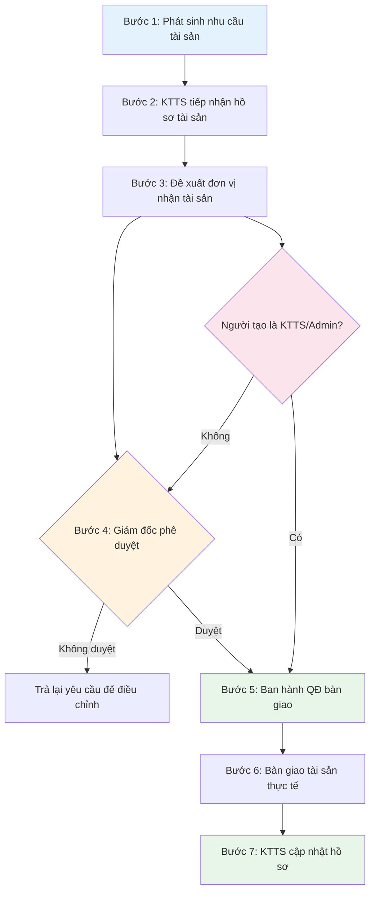

# 🔄 Quy trình 1: Tiếp nhận & Bàn giao tài sản

> **Mục đích:** Giúp bạn quản lý việc tiếp nhận tài sản mới và bàn giao tài sản cho khoa/phòng sử dụng.
>
> **Tác nhân:** Khoa/phòng yêu cầu, KTTS, VT-TB/HCQT/CNTT, Giám đốc.
>
> **Tài liệu gốc:** Mục 5.1, trang 5–6.

---

## Sơ đồ quy trình

---

## Chi tiết từng bước

### Bước 1 – Phát sinh nhu cầu tài sản

Khoa/phòng xác định nhu cầu trang bị thêm tài sản hoặc trang thiết bị và lập yêu cầu. Nếu là mua sắm thì thực hiện theo [Quy trình Đề xuất mua thiết bị](../acquisition/acquisition.md).

**Thao tác trên phần mềm:** Khoa/phòng tạo đề xuất mua qua mục **Đề xuất mua thiết bị**.

### Bước 2 – Tiếp nhận tài sản

KTTS tiếp nhận thông tin/hồ sơ tài sản sau khi hoàn thành mua sắm, bao gồm các thông tin phục vụ quản lý và ghi nhận tài sản.

**Thao tác trên phần mềm:** KTTS vào mục **Quản lý Tài sản** → **"➕ Thêm tài sản"** → nhập đầy đủ thông tin.

### Bước 3 – Đề xuất đơn vị nhận tài sản

Khoa/phòng lập danh sách tài sản đề nghị giao và xác định khoa/phòng dự kiến sử dụng.

**Thao tác trên phần mềm:** Tạo phiếu tại mục **Điều chuyển tài sản**, chọn phòng giao và phòng nhận.

### Bước 4 – Phê duyệt

Giám đốc xem xét yêu cầu bàn giao:
- **Không duyệt** → Trả lại yêu cầu để điều chỉnh/xử lý.
- **Duyệt** → Chuyển sang lập quyết định bàn giao.

> ⚡ **Luồng đặc biệt KTTS/Admin:** Khi KTTS hoặc Admin tạo đơn → **Bỏ qua bước phê duyệt** → Chuyển thẳng sang Bước 5.

**Thao tác trên phần mềm:** Giám đốc vào mục **Điều chuyển** → nhấn **"Phê duyệt"** → Duyệt hoặc Từ chối.

### Bước 5 – Ban hành quyết định bàn giao

Căn cứ yêu cầu đã được duyệt, lập Quyết định bàn giao – **BM.01.TC.05.01**.

**Thao tác trên phần mềm:** Nhấn **"Xuất biên bản"** trong phiếu điều chuyển.

### Bước 6 – Bàn giao tài sản

Bộ phận phụ trách tài sản phối hợp với khoa/phòng thực hiện bàn giao thực tế. Hai bên lập Biên bản bàn giao, tiếp nhận tài sản công – **BM.02.TC.05.01**.

### Bước 7 – Cập nhật hồ sơ tài sản

KTTS ghi sổ, hạch toán tài sản và cập nhật thông tin quản lý tài sản trên hệ thống.

**Thao tác trên phần mềm:** KTTS cập nhật **Phòng ban sử dụng** trong mục **Quản lý Tài sản**.

---

## Kết quả

Tài sản được bàn giao cho đúng khoa/phòng và được ghi nhận vào hồ sơ quản lý tài sản.
