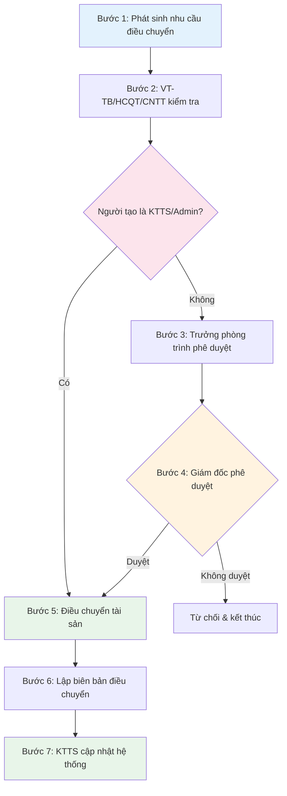

# 🔄 Quy trình 3: Điều chuyển tài sản

> **Mục đích:** Giúp bạn quản lý việc chuyển tài sản từ khoa/phòng đang sử dụng sang khoa/phòng khác.
>
> **Tác nhân:** Khoa/phòng giao, khoa/phòng nhận, VT-TB/HCQT/CNTT, KTTS, Giám đốc.
>
> **Tài liệu gốc:** Mục 5.3, trang 8.

---

## Sơ đồ quy trình

---

## Chi tiết từng bước

### Bước 1 – Phát sinh nhu cầu điều chuyển

Căn cứ nhu cầu sử dụng thực tế, khoa/phòng tạo yêu cầu điều chuyển tài sản.

**Thao tác trên phần mềm:**
- Vào mục **Điều chuyển** → **"➕ Tạo phiếu điều chuyển"**.
- Hoặc quét **QR Code** trên tài sản → chọn **"Điều chuyển"**.
- Lựa chọn: Tài sản cần điều chuyển, Phòng nhận, Nội dung/lý do.

### Bước 2 – Kiểm tra yêu cầu

Bộ phận VT-TB/HCQT/CNTT tiếp nhận và kiểm tra yêu cầu.

### Bước 3 – Trình phê duyệt

Trưởng phòng phụ trách lựa chọn người thực hiện và chuyển yêu cầu đến Giám đốc phê duyệt.

### Bước 4 – Xử lý phê duyệt

- **Không duyệt** → Kết thúc/từ chối yêu cầu.
- **Duyệt** → Chuyển sang thực hiện điều chuyển.

> ⚡ **Luồng KTTS/Admin:** Bỏ qua Bước 3 và 4 → Chuyển thẳng sang Bước 5.

### Bước 5 – Điều chuyển tài sản

Bộ phận phụ trách phối hợp với khoa/phòng giao và khoa/phòng nhận thực hiện bàn giao tài sản thực tế.

### Bước 6 – Lập biên bản

Các bên lập **Biên bản điều chuyển tài sản, thiết bị – BM.05.TC.05.01**. Biên bản được lập thành 03 bản giao cho các bên liên quan.

**Thao tác trên phần mềm:** Nhấn **"Xuất biên bản"** trong phiếu điều chuyển để tạo file Word.

### Bước 7 – Cập nhật hệ thống

KTTS cập nhật đơn vị/khoa/phòng đang quản lý, sử dụng tài sản trên phần mềm.

**Thao tác trên phần mềm:** Hệ thống tự động cập nhật phòng ban quản lý/sử dụng khi phiếu hoàn thành.

---

## Kết quả

Quyền quản lý/sử dụng tài sản được chuyển từ khoa/phòng cũ sang khoa/phòng mới và dữ liệu trên hệ thống được cập nhật tương ứng.
